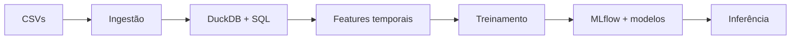

# Forecast de Consumo Energético

[](https://www.python.org/)
[](https://duckdb.org/)
[](https://mlflow.org/)

Pipeline reproduzível para previsão de consumo energético residencial. O projeto integra tratamento de dados, feature engineering em SQL, validação temporal, comparação de modelos, tracking com MLflow e inferência versionada.

## Objetivo

Prever consumo diário a partir do histórico por cliente, variáveis climáticas e atributos temporais, preservando a ordem temporal e evitando vazamento de informação.

## Arquitetura



## Pipeline

| Etapa | Responsabilidade | Saída |
|---|---|---|
| Ingestão | carregar consumo, clima e clientes | DataFrames validados |
| Transformação | corrigir regiões, imputar clima e gerar features | Parquet + DuckDB |
| Treinamento | comparar Random Forest e LightGBM | modelo e metadados |
| Inferência | aplicar o melhor modelo | previsões em Parquet |

## Feature engineering

As features são calculadas em SQL com DuckDB:

- calendário: mês, dia da semana, dia do mês e semana do ano;
- indicador de fim de semana;
- lags de consumo de 1, 2, 3 e 7 dias;
- médias móveis de 7, 14 e 30 dias;
- mínimo, máximo e desvio-padrão móvel;
- temperatura, umidade e temperatura defasada;
- codificação da região.

As janelas usam apenas observações anteriores à data prevista.

## Modelos e resultados

Validação principal: treino entre janeiro e maio e teste em junho.

| Modelo | MAE (kWh) | RMSE (kWh) | R² | MAPE |
|---|---:|---:|---:|---:|
| Random Forest | 1,86 | 2,39 | 0,61 | 14,5% |
| LightGBM | **1,86** | **2,38** | **0,61** | **14,5%** |

> Resultados associados ao conjunto de dados deste repositório. Eles não constituem garantia de desempenho em outros cenários.

## Execução

```bash
git clone https://github.com/viniciusds2020/desafio_aquarela_ia.git
cd desafio_aquarela_ia

python -m venv .venv
source .venv/bin/activate  # Linux/macOS
# .venv\Scripts\activate # Windows

pip install -r requirements.txt
python src/pipeline.py
```

Etapas independentes:

```bash
python src/pipeline.py --step ingest
python src/pipeline.py --step transform
python src/pipeline.py --step train
python src/pipeline.py --step inference
```

Visualize os experimentos:

```bash
mlflow ui --backend-store-uri models/mlruns
```

## Artefatos gerados

```text
data/energy.duckdb
data/features_processed.parquet
data/predictions.parquet
data/inference_output.parquet
models/best_model.pkl
models/metadata_latest.json
models/mlruns/
```

## Estrutura

```text
data/                       # fontes e artefatos processados
notebooks/                  # EDA e modelagem
dashboards/                 # análises com Plotly
models/                     # modelos, metadados e MLflow
src/pipeline.py             # pipeline ponta a ponta
src/generate_presentation.py
apresentacao.pdf            # apresentação executiva
```

## Decisões técnicas

- split por tempo em vez de amostragem aleatória;
- DuckDB para transformação analítica local com SQL;
- lags e rolling windows calculados sem usar o futuro;
- MLflow para rastrear parâmetros, métricas e artefatos;
- seleção do melhor modelo por RMSE;
- metadados versionados para rastreabilidade.

## Limitações

- o cutoff temporal está configurado para o dataset do projeto;
- inferência operacional exigiria uma rotina para construir features futuras;
- MAPE deve ser interpretado com cuidado quando o consumo se aproxima de zero;
- ainda não há monitoramento de drift ou retreinamento automatizado.

## Próximas evoluções

- [ ] backtesting rolling-origin;
- [ ] testes de dados e pipeline;
- [ ] configuração externa de datas e hiperparâmetros;
- [ ] registro formal de modelos;
- [ ] API de inferência e monitoramento.

## Autor

Desenvolvido por [Vinicius de Sousa](https://github.com/viniciusds2020).
